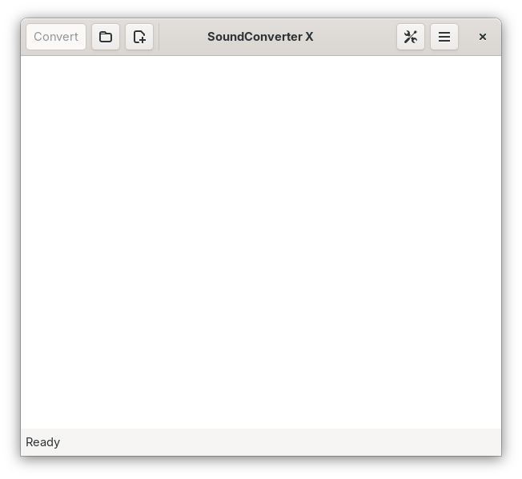
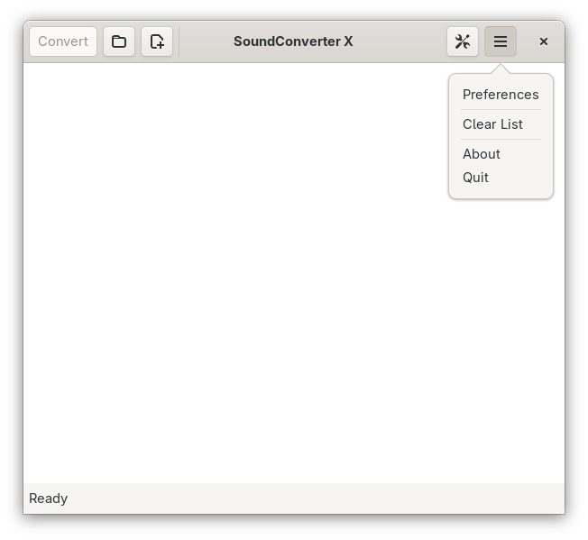
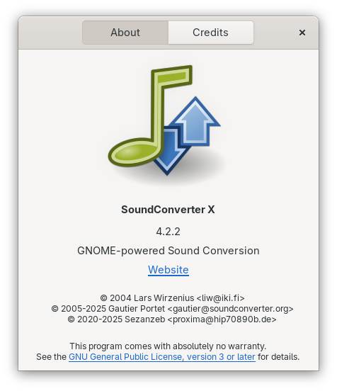
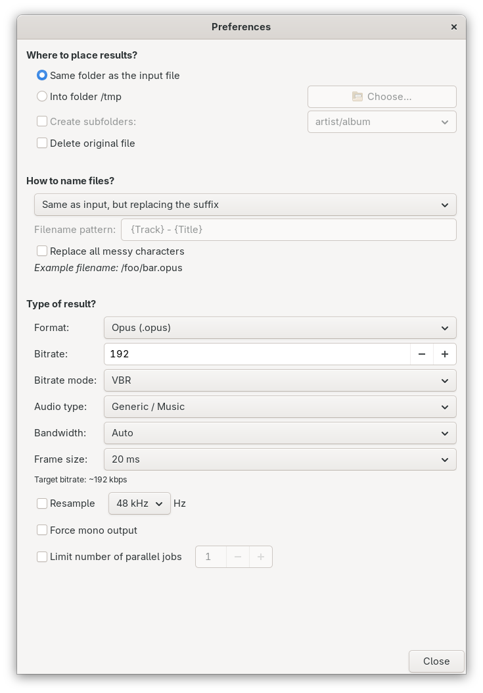
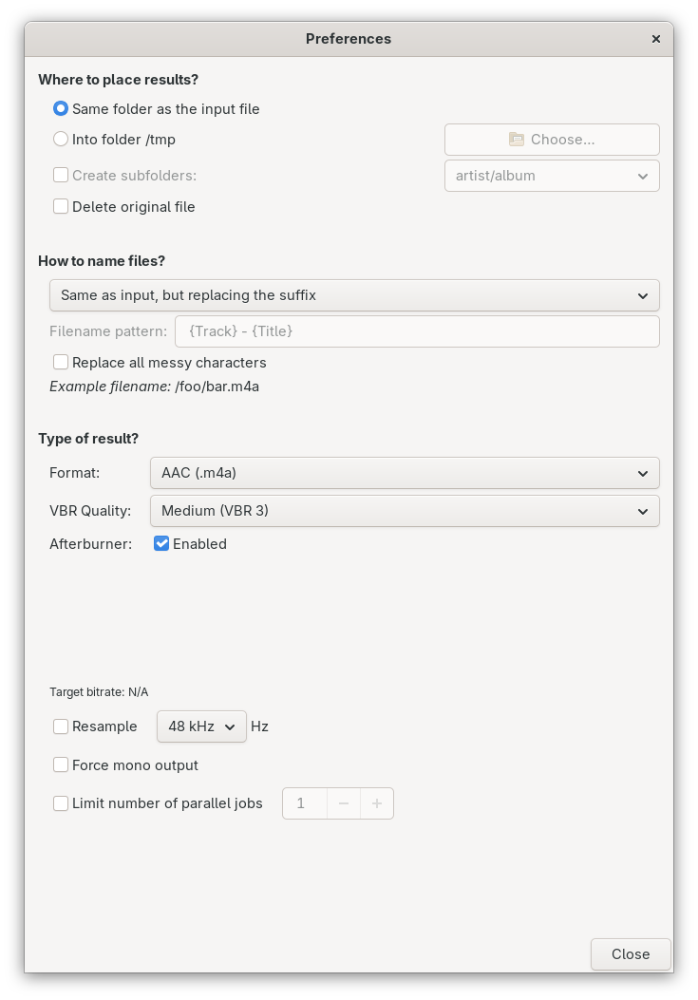
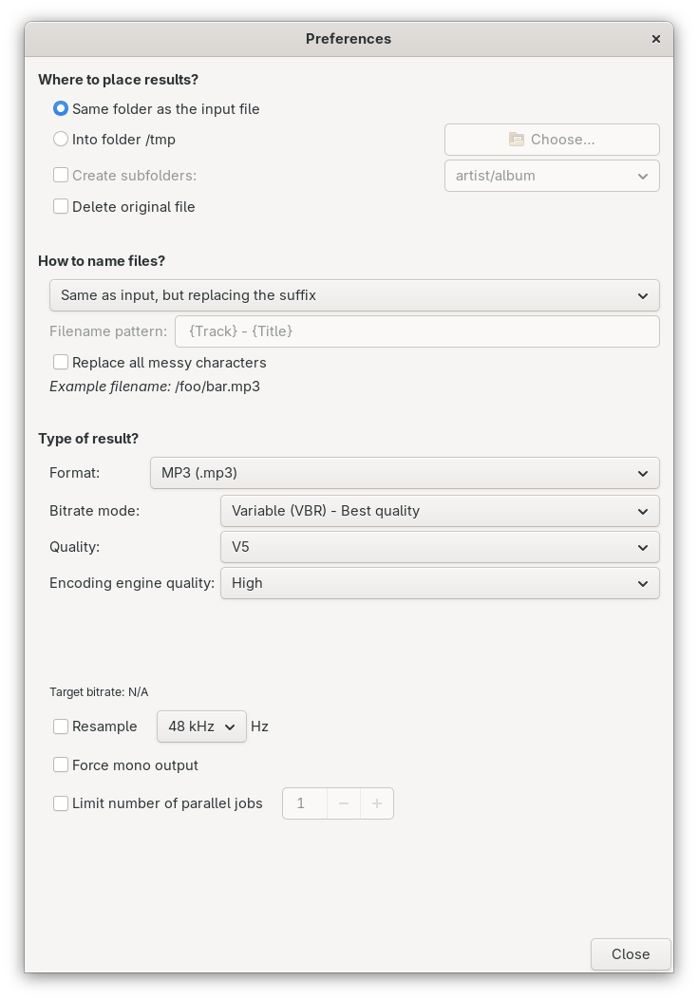
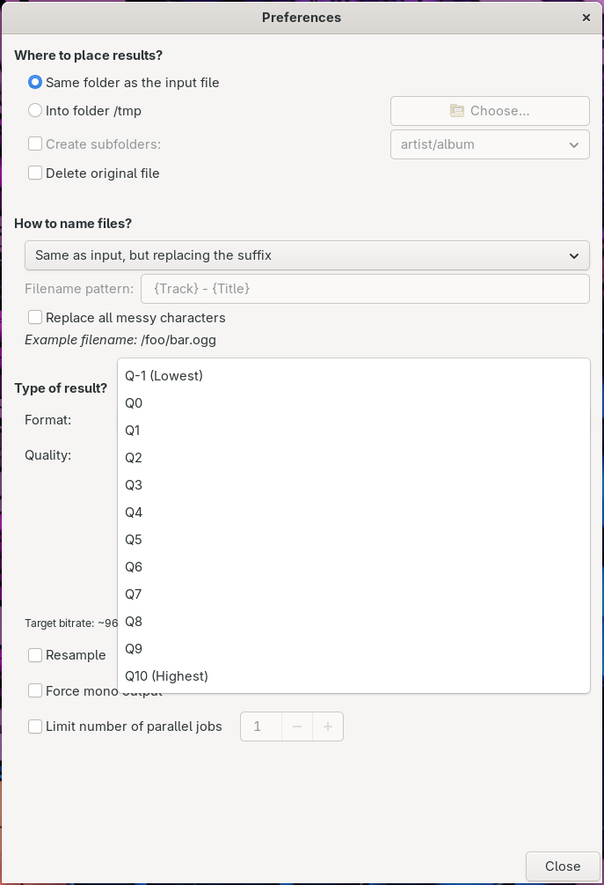
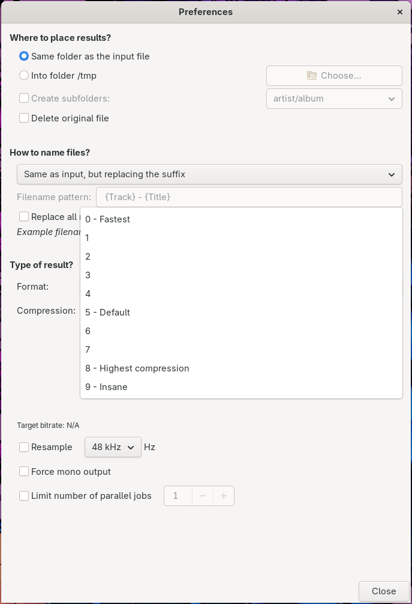
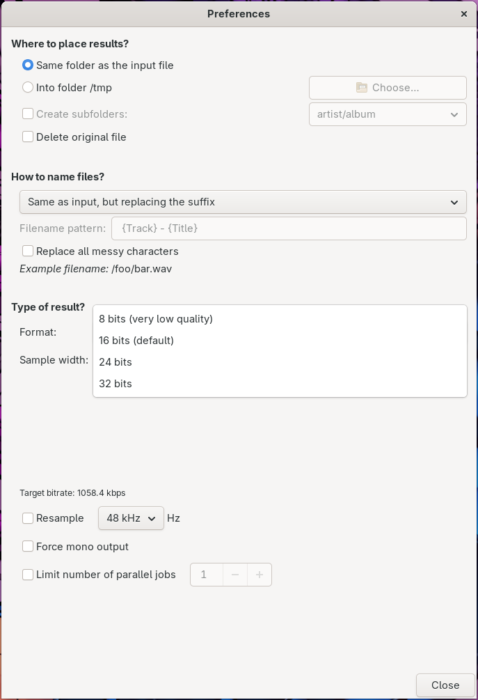

[](https://github.com/Megatron-X/soundconverter/actions/workflows/tests.yml)
[](https://github.com/Megatron-X/soundconverter/actions/workflows/ruff.yml)

# SoundConverter X

 **SoundConverter X** is an enhanced
fork of SoundConverter, a simple audio conversion application for the GNOME
desktop built on GStreamer.

SoundConverter X extends the original application with advanced codec controls,
additional lossless output options, improved conversion behavior, and expanded
testing while preserving SoundConverter's simple interface.

<br clear="left"/>

## What's New in SoundConverter X 4.2.2

### Opus
- Configurable bitrate
- VBR, constrained VBR, and CBR modes
- Generic, music, and speech tuning
- Configurable bandwidth
- Configurable frame size

### FDK-AAC
- VBR presets 1–5
- Afterburner support

### LAME MP3
- CBR bitrate selection
- ABR bitrate selection
- VBR quality selection from V9 through V0
- Encoding-engine quality control

### Ogg Vorbis
- Full quality range from Q-1 through Q10

### FLAC
- Compression levels 0–9

### WMA
- Expanded bitrate selection

### WAVE
- 8-bit output
- 16-bit output
- 24-bit output
- 32-bit output

### Additional improvements
- Improved file-permission handling after conversion
- Self-contained Meson test environment
- Automatic GSettings schema compilation for tests
- Arch Linux PKGBUILD included

## Screenshots

### Main Window

<p align="center">
  
</p>

### Application Menu

<p align="center">
  
</p>

### About

<p align="center">
  
</p>

### Opus

<p align="center">
  
</p>

### FDK-AAC

<p align="center">
  
</p>

### LAME MP3

<p align="center">
  
</p>

### Ogg Vorbis

<p align="center">
  
</p>

### FLAC

<p align="center">
  
</p>

### WAVE

<p align="center">
  
</p>

Additional screenshots for all codec controls are available in
[`docs/screenshots`](docs/screenshots/).

## Building and Installation

SoundConverter X uses Meson.

### Build from source

```bash
git clone https://github.com/Megatron-X/soundconverter.git
cd soundconverter

meson setup builddir
meson compile -C builddir
meson install -C builddir

soundconverter
```

### Arch Linux

An Arch Linux `PKGBUILD` is included in the repository.

Current package metadata:

- Package: `soundconverter-x`
- Version: `4.2.2`
- Package release: `2`
- Architecture: `any`

Build and install with:

```bash
makepkg -si
```

### Help

For command-line options:

```bash
soundconverter --help
gst-launch-1.0 --help-gst
```

GStreamer documentation:

https://gstreamer.freedesktop.org/documentation/

### Testing

Configure and build the test environment:

```bash
meson setup builddir
meson compile -C builddir
meson test -C builddir
```

Before submitting changes, format and check the Python source:

```bash
ruff format soundconverter bin/soundconverter
ruff check soundconverter bin/soundconverter
```

### Upstream Project

SoundConverter X is based on the original SoundConverter project:

https://github.com/kassoulet/soundconverter

### Copyright and Acknowledgements

Copyright 2004 Lars Wirzenius
Copyright 2005-2025 Gautier Portet
Copyright 2020-2025 Sezanzeb

Thanks to: Guillaume Bedot, Dominik Zabłotny, Noa Resare, Nil Gradisnik, Elias Autio, Thom Pischke, Qball Cow, Janis Blechert, Brendan Martens, Jason Martens, Wouter Stomp, Joe Wrigley, Jonh Wendell, Regis Floret, Toni Fiz, Seketeli Apelete, Cristiano Canguçu, Adolfo González Blázquez, Marc E., Tobias Kral, Hanno Böck, Pedro Alejandro López-Valencia, James Lee, Christopher Barrington-Leigh, Thomas Schwing, Remi Grolleau, Julien Gascard, Kamil Páral, Stefano Luciani, Martin Seifert, Claudio Saavedra, Ken Harris, Jon Arnold, Major Kong, Uwe Bugla

This program is free software; you can redistribute it and/or modify it
under the terms of the GNU General Public License as published by the
Free Software Foundation; version 3 of the License.
This program is distributed in the hope that it will be useful, but
WITHOUT ANY WARRANTY; without even the implied warranty of
MERCHANTABILITY or FITNESS FOR A PARTICULAR PURPOSE. See the GNU General
Public License for more details.
You should have received a copy of the GNU General Public License along
with this program; if not, write to the Free Software Foundation, Inc.,
59 Temple Place, Suite 330, Boston, MA 02111-1307 USA
